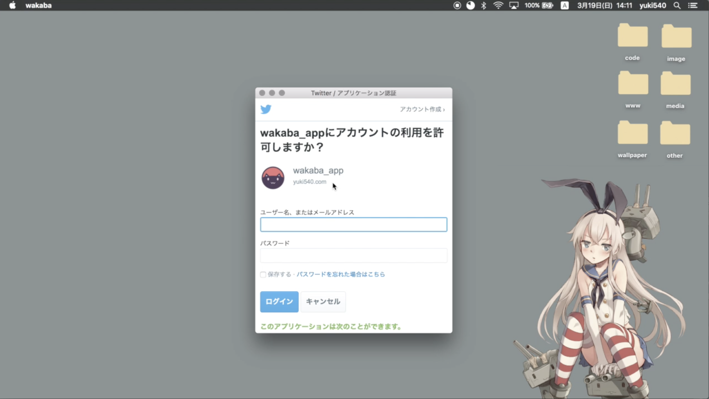
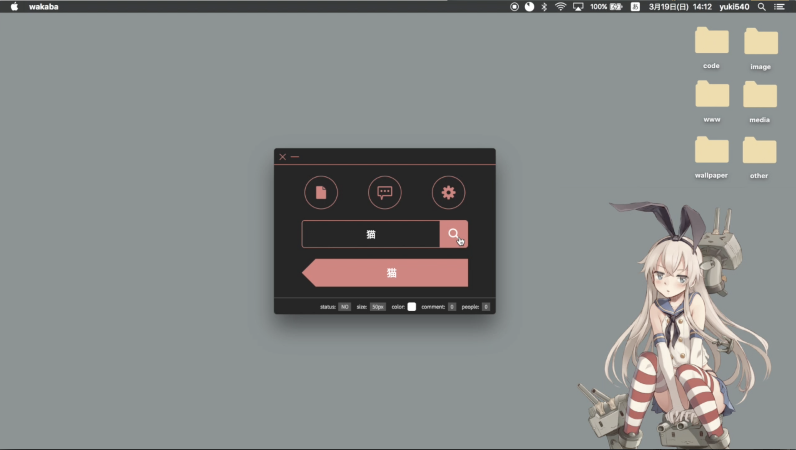
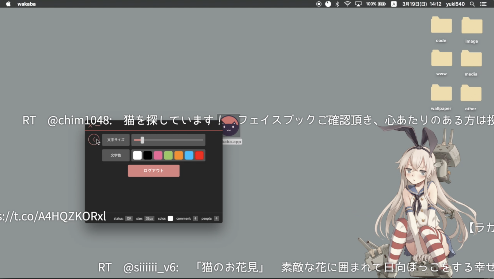
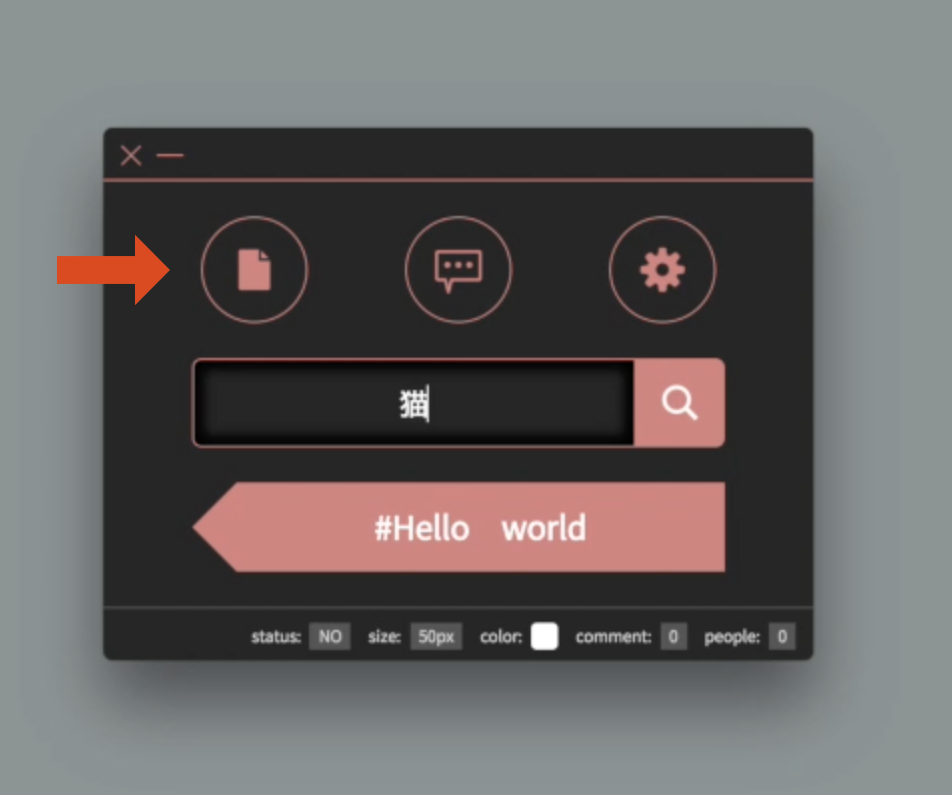
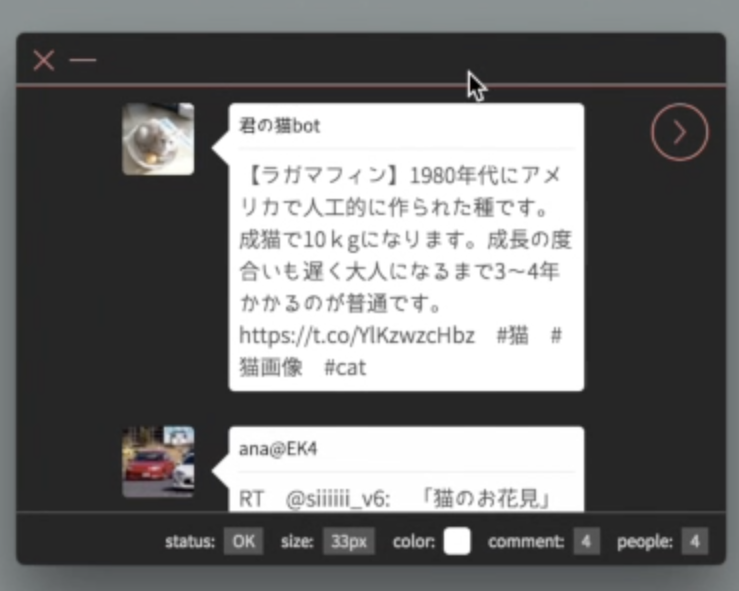
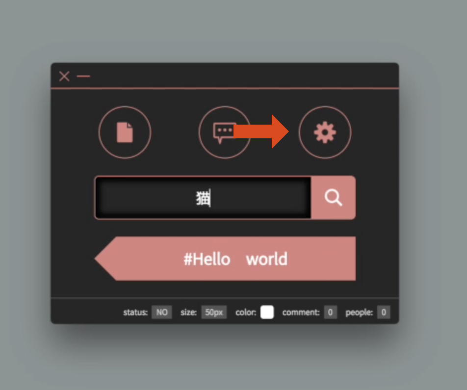
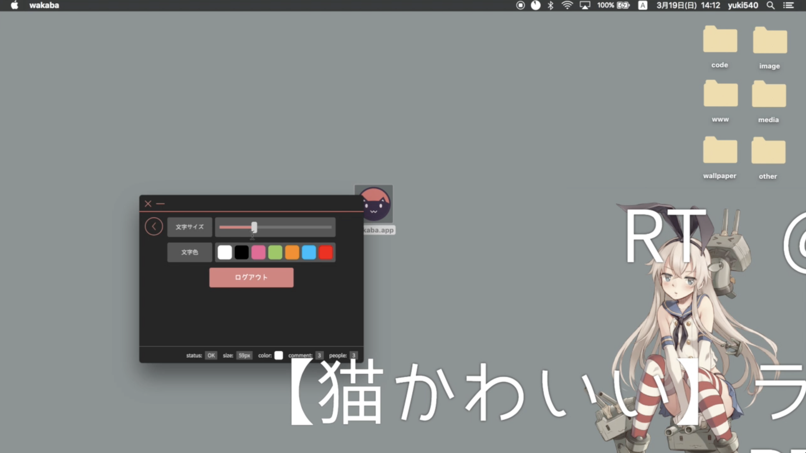
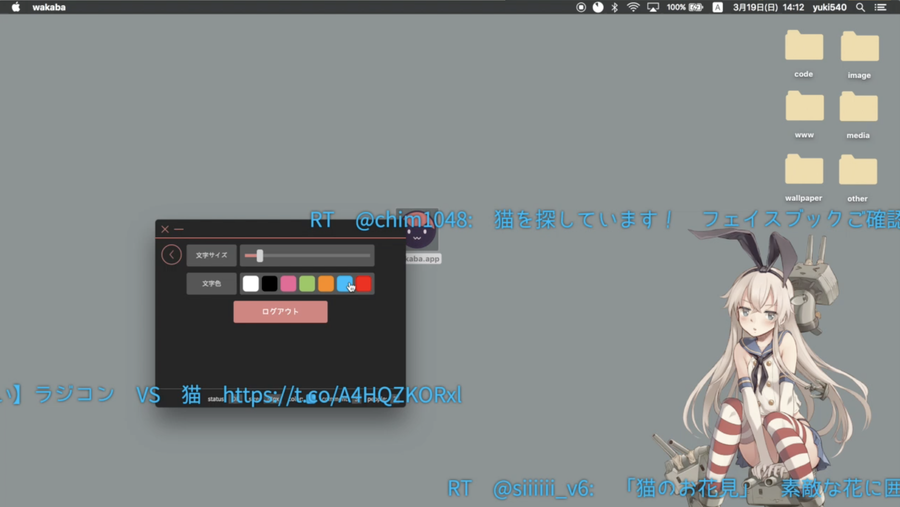
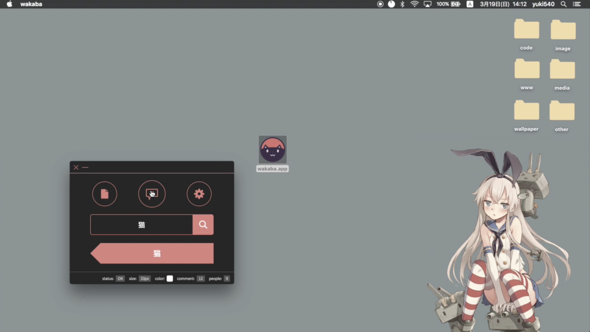

# wakaba
PC画面上にコメントが流せるElectron製のデスクトップアプリ。

コメントはTwitterから特定のキーワードを含むツイートを取得して流します。

イベントやライブコーディングの時に使うと面白いかもしれません。

## Demo
　動作を確認したい場合は、[こちら](https://twitter.com/eriri_jp/status/843348414305783808)にデモ動画があります。

## Usage
### ダウンロード
GitHubの[リリースページ](https://github.com/yuki540net/wakaba/releases)からダウンロードすることができます。

~~何故か、Windows版のパッケージ化ができないのでMac版しかありません。
そのうち、Windows版もパッケージ化します。
手元にWindowsがないので、動作の保証はできませんが試したい方は自前でパッケージ化してください。~~

Mac / Windows / Linuxのパッケージ化が完了しました。

### Twitterにログイン
まず、Twitterにログインしてください。

### キーワードを入力
中央のテキストボックスに取得したいキーワードを入力し、検索ボタンを押してください。

そうすると、そのキーワードを含んだツイートが画面上に流れます。

### 履歴の確認
矢印のボタンを押すと、履歴の確認ができます。

### 文字サイズ・色
文字サイズ・色の設定ができます。
矢印のボタンを押すと、設定画面が出てきます。

スライダーを調整すると、文字の大きさを変えることができます。

色の付いたボタンを押すと、文字の色を変えることができます。

### コメントの表示・非表示
矢印のボタンを押すと、コメントの表示・非表示ができます。

## Lisence
このソフトウェアは、MIT Lisenceのもとで公開されています。